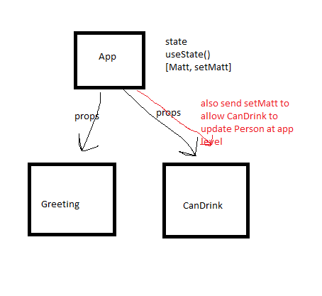
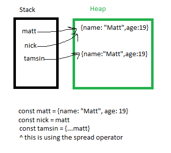
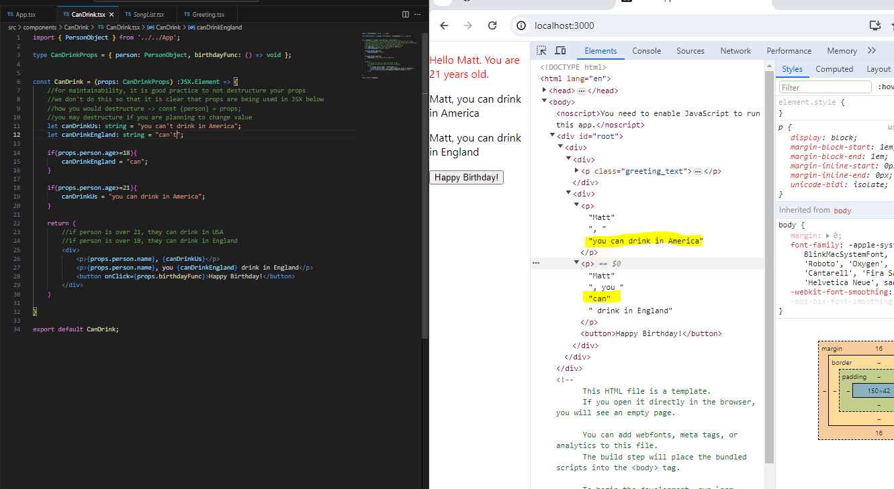

# Destructuring Props
- for maintainability, it is good practice to not destructure your props
- we don't do this so that it is clear that props are being used in JSX below
- example of destructuring -> const {person} = props;
- you may destructure if you are planning to change value

# state 
- in react we pass information down 

## useState
  - when we call useState(), it returns [] with 2 things in it
  - from useState, the function will always be a setter
  - result : [ variable , function that can change ]

  

  - useState doesn't care what we are calling it.  
  - when you are manipulating stateful variable always create a copy 

  - const nick = matt doesn't create copy; just new pointer
  - pointers!! 
  - if nick had child and you did spread operator on nick, it would only copy pointer to child (matt). It wouldn't copy value of matt itself:
    - const nick = {name: "nick", child: matt}
    - to get copy (and not just pointer)
     - const newFullCopy = (...nick, child: {...nick.child})

## Performance 

- note for england it would only have to reload can not the whole sentence. 
- you want to minimize what is variable in the jsx

# Array

Const names  = ["matt","Tamsin","Christine"]

Const newNames = names.map(name => name.toUpperCase());

newNames = ["MATT","TAMSIN","CHRISTINE"]

# right way to save tokens 

Option 1. save in cookie - hackable by the user
prefred way

Option 2. have authentication server with session 

indexDB (generic saving)

# Debugging 

Debugger built into react but 3 things have to be true
- running in development mode (npm start)
- developer tools window must be open in the broweser
- browser might have an add in https://reactjs.org/link/react-devtools

debugger; in code